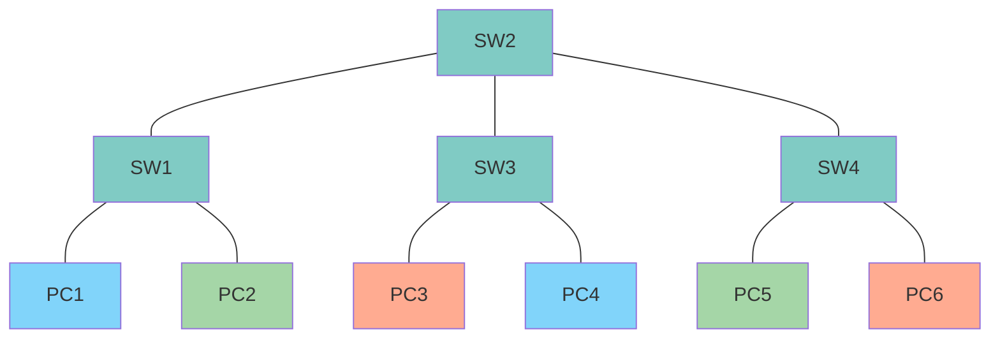

# Experiencia 1



## Detalles importantes

* Hay que guardar la configuración de cada VPC y Switch de forma *manual* usando la terminal, en caso contrario se perderá todo al reiniciar.
* No usar el comando `exit` para salir de la terminal _Telnet_ del VPC o este se apagará. Usar la alternativa mencionada en la siguiente sección.

## Consola

* Establecer conexión: `telnet localhost <puerto>`
* Cerrar conexión sin apagar dispositivo: `Ctrl+]` y luego `quit`

## VPC

* Setear IP: `ip 192.168.3.2/24`
* Ver configuración de IP: `show ip`
* **Guardar configuración:** `save`

## Switch

Los comandos se organizan en una serie de subniveles, similar a moverse dentro de una serie de carpetas. Al igual que en una típica terminal de Linux, el _prompt_ indica el nivel en el que estamos situados:

```bash
# En raíz
SW1#

# En configuración de VLAN
SW1(vlan)#

# En configuración general
SW1(config)#

# En configuración general, operando sobre un único puerto
SW1(config-if)#

# En configuración general, operando sobre múltiples puertos
SW1(config-if-range)#
```

Para volver al nivel superior simplemente se usa `exit`

### Comandos disponibles en terminal raíz

* Ingresar a configuración de VLANs: `vlan database`
* Ingresar a configuración general: `configure terminal`
* Mostrar VLANs y puertos asociados: `show vlan-switch`
* **Guardar configuración:** `copy running-config startup-config`

### Comandos en subnivel vlan

* Crear VLAN: `vlan <num_vlan>`

### Comandos en configuración general

* Configurar un único puerto: `interface FastEthernet 0/<num>`
* Configurar múltiples puertos: `interface range FastEthernet 0/<num0> , FastEthernet 0/<num1> , ...`

#### Comandos en configuración de puerto(s)

* Cambiar a modo _access_ (única VLAN): `switchport mode access`
* Cambiar a modo _trunk_ (múltiples VLANs): `switchport mode trunk`

Una vez fijado el modo del puerto, se puede usar los siguientes comandos:

* Asignar VLAN en modo _access_: `switchport access vlan <num_vlan>`
* Asignar VLANs en modo _trunk_: `switchport trunk allowed vlan <num_vlan1>,<num_vlan2>,...,1-2,1002-1005`
